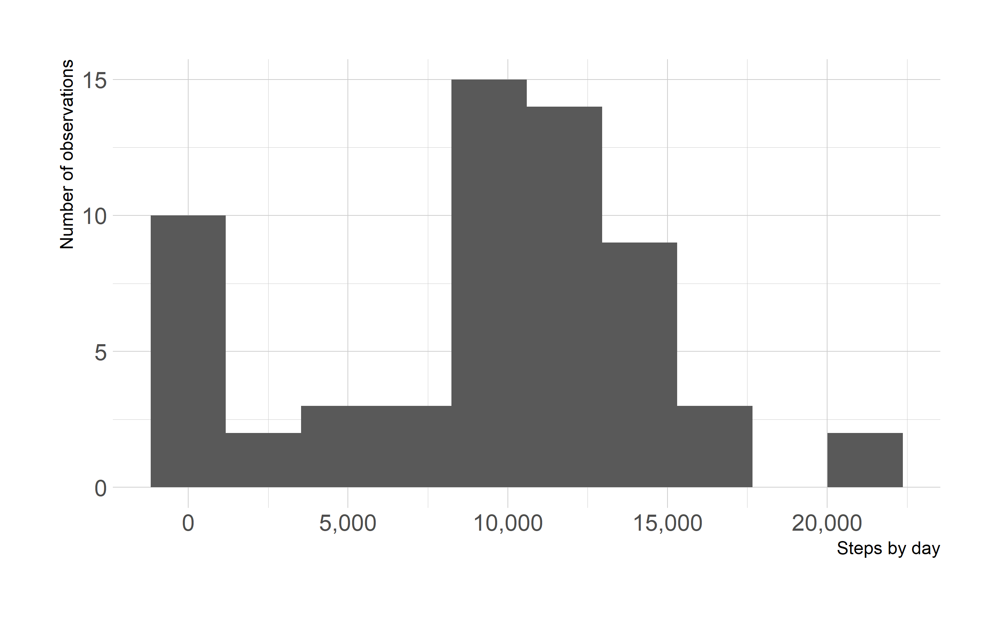
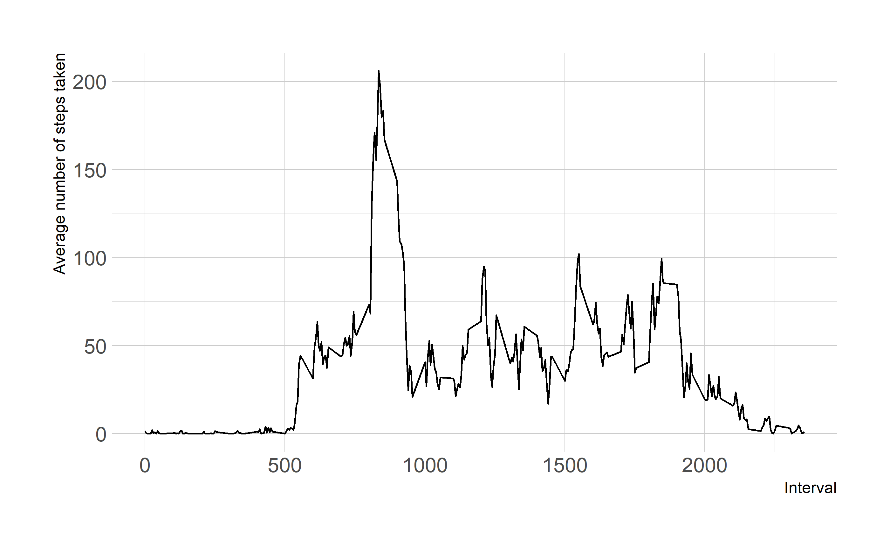
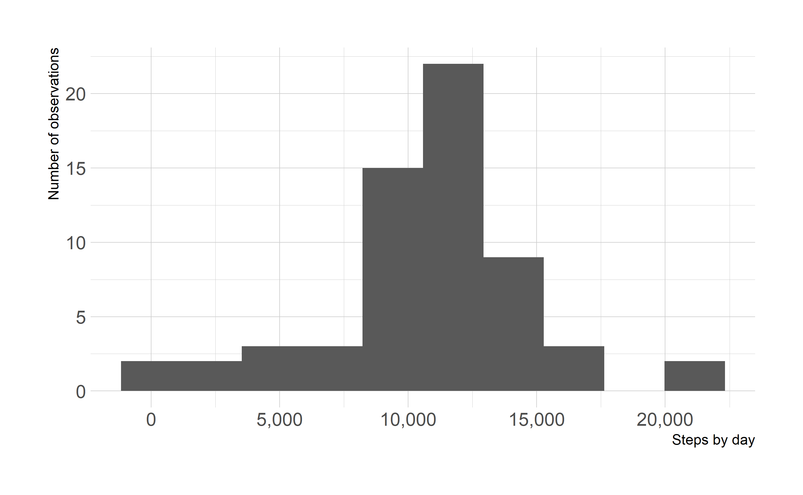
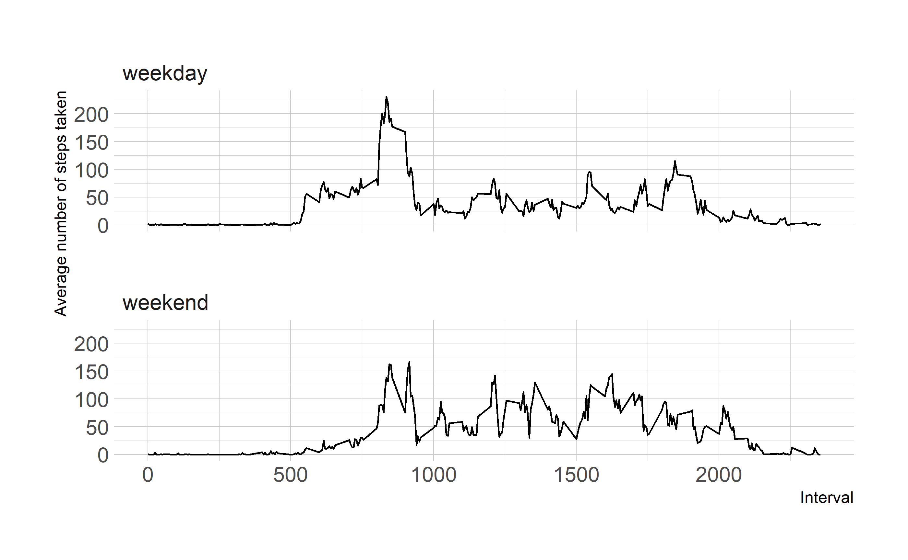

```r
# Add packages
library(tidyverse)
library(skimr)
library(scales)
library(lubridate)

# Defaults
theme_set(hrbrthemes::theme_ipsum())
```

## Loading and preprocessing the data


```r
unzip("./activity.zip")

raw_data <- read_csv("./activity.csv")

skim(raw_data)
```


Table: Data summary

|                         |         |
|:------------------------|:--------|
|Name                     |raw_data |
|Number of rows           |17568    |
|Number of columns        |3        |
|_______________________  |         |
|Column type frequency:   |         |
|Date                     |1        |
|numeric                  |2        |
|________________________ |         |
|Group variables          |None     |


**Variable type: Date**

|skim_variable | n_missing| complete_rate|min        |max        |median     | n_unique|
|:-------------|---------:|-------------:|:----------|:----------|:----------|--------:|
|date          |         0|             1|2012-10-01 |2012-11-30 |2012-10-31 |       61|


**Variable type: numeric**

|skim_variable | n_missing| complete_rate|    mean|    sd| p0|   p25|  p50|  p75| p100|hist                                     |
|:-------------|---------:|-------------:|-------:|-----:|--:|-----:|----:|----:|----:|:----------------------------------------|
|steps         |      2304|          0.87|   37.38| 112.0|  0|   0.0|    0|   12|  806|▇▁▁▁▁ |
|interval      |         0|          1.00| 1177.50| 692.5|  0| 588.8| 1178| 1766| 2355|▇▇▇▇▇ |

## What is mean total number of steps taken per day?

### Calculate the total number of steps taken per day


```r
days_data <- raw_data %>%
  group_by(date) %>%
  summarise(total_steps = sum(steps, na.rm = TRUE))
```

### Make a histogram of the total number of steps taken each day


```r
days_data %>%
  ggplot(aes(total_steps)) +
  geom_histogram(bins = 10) +
  scale_x_continuous(labels = comma) +
  labs(x = "Steps by day", y = "Number of observations")
```



### Calculate and report the mean and median of the total number of steps taken per day


```r
days_data %>%
  summarise(
    mean_steps = mean(total_steps, na.rm = TRUE),
    median_steps = median(total_steps, na.rm = TRUE)
  )
#> # A tibble: 1 x 2
#>   mean_steps median_steps
#>        <dbl>        <dbl>
#> 1      9354.        10395
```

## What is the average daily activity pattern?

### Make a time series plot of the 5-minute interval (x-axis) and the average number of steps taken, averaged across all days (y-axis)


```r
raw_data %>%
  group_by(interval) %>%
  summarise(total_steps = mean(steps, na.rm = TRUE)) %>%
  ggplot(aes(interval, total_steps)) +
  geom_line() +
  labs(x = "Interval", y = "Average number of steps taken")
```



### Which 5-minute interval, on average across all the days in the dataset, contains the maximum number of steps?


```r
raw_data %>%
  group_by(interval) %>%
  summarise(total_steps = mean(steps, na.rm = TRUE)) %>%
  arrange(desc(total_steps)) %>%
  slice(1)
#> # A tibble: 1 x 2
#>   interval total_steps
#>      <dbl>       <dbl>
#> 1      835        206.
```

## Imputing missing values

### Calculate and report the total number of missing values in the dataset 


```r
raw_data %>%
  filter(is.na(steps)) %>%
  count(steps)
#> # A tibble: 1 x 2
#>   steps     n
#>   <dbl> <int>
#> 1    NA  2304
```

### Devise a strategy for filling in all of the missing values in the dataset


```r
imputed_data <- raw_data %>%
  group_by(interval) %>%
  mutate(mean_steps = mean(steps, na.rm = TRUE)) %>%
  ungroup() %>%
  mutate(
    steps = if_else(
      is.na(steps),
      mean_steps,
      steps
    )
  ) %>%
  select(-mean_steps)
```

### Create a new dataset that is equal to the original dataset but with the missing data filled in


```r
imputed_data %>%
  skim()
```


Table: Data summary

|                         |           |
|:------------------------|:----------|
|Name                     |Piped data |
|Number of rows           |17568      |
|Number of columns        |3          |
|_______________________  |           |
|Column type frequency:   |           |
|Date                     |1          |
|numeric                  |2          |
|________________________ |           |
|Group variables          |None       |


**Variable type: Date**

|skim_variable | n_missing| complete_rate|min        |max        |median     | n_unique|
|:-------------|---------:|-------------:|:----------|:----------|:----------|--------:|
|date          |         0|             1|2012-10-01 |2012-11-30 |2012-10-31 |       61|


**Variable type: numeric**

|skim_variable | n_missing| complete_rate|    mean|    sd| p0|   p25|  p50|  p75| p100|hist                                     |
|:-------------|---------:|-------------:|-------:|-----:|--:|-----:|----:|----:|----:|:----------------------------------------|
|steps         |         0|             1|   37.38| 105.3|  0|   0.0|    0|   27|  806|▇▁▁▁▁ |
|interval      |         0|             1| 1177.50| 692.5|  0| 588.8| 1178| 1766| 2355|▇▇▇▇▇ |

### Make a histogram of the total number of steps taken each day and Calculate and report the mean and median total number of steps taken per day


```r
imputed_data %>%
  group_by(date) %>%
  summarise(total_steps = sum(steps, na.rm = TRUE)) %>%
  ggplot(aes(total_steps)) +
  geom_histogram(bins = 10) +
  scale_x_continuous(labels = comma) +
  labs(x = "Steps by day", y = "Number of observations")
```




```r
imputed_data %>%
  group_by(date) %>%
  summarise(total_steps = sum(steps, na.rm = TRUE)) %>%
  summarise(
    mean_steps = mean(total_steps, na.rm = TRUE),
    median_steps = median(total_steps, na.rm = TRUE)
  )
#> # A tibble: 1 x 2
#>   mean_steps median_steps
#>        <dbl>        <dbl>
#> 1     10766.       10766.
```

The values differ substantially from the previous calculations. Likewise, the distribution is now more normal.

## Are there differences in activity patterns between weekdays and weekends?

### Create a new factor variable in the dataset with two levels – “weekday” and “weekend” indicating whether a given date is a weekday or weekend day


```r
final_data <- imputed_data %>%
  mutate(
    type_day = wday(date, label = TRUE, abbr = FALSE),
    type_day = if_else(
      type_day %in% c("sábado", "domingo"),
      "weekend",
      "weekday"
    ),
    type_day = factor(type_day, c("weekday", "weekend"))
  )
```

### Make a panel plot containing a time series plot of the 5-minute interval (x-axis) and the average number of steps taken, averaged across all weekday days or weekend days (y-axis)


```r
final_data %>%
  group_by(interval, type_day) %>%
  summarise(total_steps = mean(steps, na.rm = TRUE)) %>%
  ggplot(aes(interval, total_steps)) +
  geom_line() +
  labs(x = "Interval", y = "Average number of steps taken") +
  facet_wrap(~type_day, nrow = 2)
```


